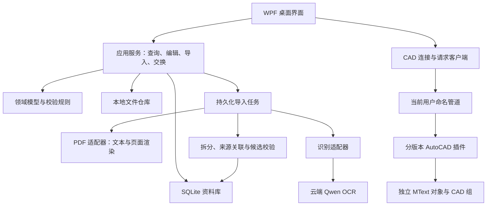

# 建筑做法资料库与 CAD 插入工具 · 技术架构说明

> 文档版本：0.1  
> 更新日期：2026-09-20  
> 状态：设计基线，已进入实现阶段。技术选型继承项目计划，验证前不视为兼容性结论。net48 原生依赖（SQLite）固定 win-x64 RID，见 docs/decisions/0001-net48-native-sqlite-rid.md。  
> 产品边界见 [PRD](PRD.md)，Agent 执行规则见 [AGENTS.md](../AGENTS.md)。

## 1. 架构目标与约束

1. 本地优先：查找、编辑、原文查看和 CAD 插入不依赖云端。
2. 以条目为中心：图集、页、做法、层次与历史有明确关联。
3. 原文可追溯：原 PDF 与识别原始响应不能被当前编辑文字替代。
4. 人工修改优先：重识别只创建候选，不能覆盖已保存修订。
5. CAD 薄插件：PDF、网络和资料库逻辑不放入 CAD 进程。
6. 可恢复：任务、云端请求和 CAD 请求都要区分成功、失败与结果未知。
7. 分版本实测：构建成功不等于 AutoCAD 运行兼容。

第一版采用模块化桌面单体加 CAD 插件，不部署服务器、微服务、向量数据库或用户账号服务。

## 2. 系统组成



### 2.1 模块责任

| 模块 | 负责 | 不负责 |
| --- | --- | --- |
| Desktop | 三栏界面、预览、编辑交互、任务与连接状态 | 直接执行 SQL 或 AutoCAD API |
| Application | 用例编排、事务边界、任务恢复、导出导入 | WPF 控件和 CAD 图纸对象 |
| Domain | 条目、层次、来源、修订规则和校验 | 文件路径、云 SDK、UI 框架 |
| Infrastructure | SQLite、文件仓库、安全存储、PDF、云识别实现 | 改写产品规则 |
| Contracts | 识别输入输出与 CAD 协议的数据契约 | AutoCAD 类型、UI 控件、数据库实体 |
| CadPlugin | 实例发现、目标图纸检查、选点与原子插入 | 识别 PDF、连接云端、直接读写资料库 |
| Tests | 领域、存储、恢复、协议及集成验证 | 用模拟结果代替真机兼容结论 |

依赖方向：Desktop → Application → Domain；Infrastructure 实现 Application 定义的边界接口；CadPlugin 只依赖轻量 Contracts 及对应 AutoCAD SDK。禁止桌面程序引用 Autodesk 程序集。

### 2.2 建议技术基线

| 项目 | 建议 | 实施时验证点 |
| --- | --- | --- |
| 桌面程序 | C#、WPF、.NET Framework 4.8、64 位 | 目标 Windows 环境和部署方式 |
| UI 组织 | MVVM | 可测试性与异步 UI 更新 |
| 本地数据库 | SQLite，显式迁移版本 | 驱动对 .NET Framework 的支持、原生依赖和备份能力 |
| PDF | PDFium 作为渲染／文本适配器基础 | 原生库位数、中文、加密／损坏文件、安全更新与许可证 |
| 云识别 | Qwen OCR 适配器，可配置 endpoint 和模型版本 | 当期 API、区域、任务格式、坐标输出、单价和返回约束 |
| 通信 | 命名管道、长度前缀 UTF-8 JSON | 当前用户权限、超时、协议版本及消息大小限制 |
| CAD | Managed .NET API、分版本宿主适配 | SDK／Framework／安装包注册与实际加载 |
| 密钥 | Windows DPAPI CurrentUser | 不可随资料包迁移；另一台电脑重新配置 |

具体 NuGet 版本在环境验证时锁定，不在文档阶段安装或凭记忆填版本。若旧 Framework 与依赖不兼容，先给出影响分析，再记录架构决策；不要无声替换整个技术栈。

## 3. 数据模型与存储

### 3.1 核心模型

| 实体 | 关键属性与约束 |
| --- | --- |
| Atlas 图集 | UUID、名称、编号、地区 ID、年份／版本说明、原文件指纹、受管理文件路径 |
| AtlasPage 页面 | UUID、图集 ID、1 起始 PDF 页序、可空印刷页码、页面尺寸、图像缓存键 |
| Practice 做法 | UUID、图集 ID（自定义可空）、名称、编号、主部位 ID、备注、引用说明、当前修订、核对状态、归档状态 |
| PracticeLayer 层次 | UUID、做法 ID、连续排序号、原始文本、当前文本；不将厚度数值作为正文唯一来源 |
| PracticeSource 来源 | 做法 ID、页面 ID、可空矩形区域、区域来源与可靠性；允许多页和多个区域 |
| PracticeRevision 修订 | 做法 ID、递增修订号、完整业务快照、原因、时间；不可覆盖历史记录 |
| RecognitionRun 识别 | 输入指纹、配置指纹、原始响应路径、服务商请求 ID、时间、结果状态、用量 |
| RecognitionCandidate 候选 | 原识别任务、目标条目（可空）、结构化候选、差异／问题列表、采用状态 |
| ImportJob／PageTask | 图集、页范围、配置快照、状态、重试数、错误、预算预留与已知用量 |
| Taxonomy／Tag | 稳定 ID、显示名称、类型；条目与标签为多对多 |
| InsertionPreset | 样式名、字高、宽度、间距、图层；数值按目标图纸单位 |
| CadRequest | 请求 UUID、目标实例／文档、内容快照摘要、处理状态、结果；用于幂等与状态查询 |

UUID 是交换时的身份标识，名称和做法编号均不作为主键。时间以 UTC 存储、按本机时区显示。外键与唯一约束必须在数据库连接中实际启用。

来源区域采用页面可视方向的归一化坐标 [0,1]，以左上角为原点；记录页面旋转和裁剪变换。预览与识别坐标必须能互相换算，不将低可靠坐标当作精确定位。

### 3.2 写入与修订

- 新做法、层次、来源、标签和首个修订在一个事务中提交。
- 每次保存要求携带预期修订号；不匹配时显示冲突，避免旧编辑窗口覆盖新内容。
- 恢复历史是生成新修订，不将数据库指针回退并删除之后的历史。
- 重识别只写候选；采用候选才更新正文及修订。
- 拆分／合并是事务操作，保留父子关系、原来源与历史，原条目归档。
- 文件先写入临时位置并校验，再登记数据库；中断产生的未引用文件通过维护任务识别，不误删有引用原文件。

### 3.3 文件目录

运行数据默认放在当前用户本地应用数据目录，具体路径可配置；开发仓库不作为用户资料目录。

```text
Library/
  library.db
  originals/       # 按内容指纹管理原 PDF
  recognition/     # 原始响应与解析中间结果
  cache/pages/     # 可重建的页面图片
  staging/         # 未完成导入与资料包暂存
  backups/
  logs/           # 不含密钥，默认不记录完整页面正文
```

数据库只存受管理相对路径，跨电脑导入后重新解析根目录。原文件与识别证据不属于可以自动清理的页面缓存。

### 3.4 搜索

为每条做法维护可重建的 SearchDocument，包含归一化名称、编号、正文、备注、图集字段及标签。保存条目和更新索引保持事务一致或使用有恢复能力的索引更新队列。

初版采用参数化 SQL 与 LIKE 完成中文子串匹配；地区、部位、图集等精确字段建索引。用户输入中的通配符转义，多关键词 AND 组合。分页使用稳定排序，避免结果跳动。

以 1 万条实际长度数据测量性能；若不能达到 PRD 指标，再通过架构决策引入适配中文的全文索引。不得为了未验证的规模提前上独立搜索服务器。

## 4. PDF 与识别流水线

### 4.1 边界接口

以下为概念契约，不要求实现者机械照抄类名，但职责和字段语义不能丢失。

| 接口 | 输入 | 输出 |
| --- | --- | --- |
| IPdfSource | 文件、页序、渲染参数 | 页数、文本块、页面图像、尺寸与坐标变换 |
| IRecognitionProvider | 图像或文本、识别任务、模型配置、取消信号 | 原始响应、文本／区域／表格、用量、请求标识、服务错误 |
| IPracticeExtractor | 页面内容、相邻上下文、图集元信息 | 候选条目、层次、来源、引用、问题列表 |
| IPracticeRepository | 查询条件／保存命令和预期修订 | 分页结果／新修订／冲突 |
| ILibraryPackageService | 条目／图集集合或资料包 | 导出结果／新增重复冲突预览／导入结果 |

供应商的 JSON 或提示词输出必须经过解析和校验，不能直接反序列化为最终业务实体并写库。Qwen OCR 是否支持某种强制结构输出须按选定模型核实；不能用提示词代替格式可靠性校验。

### 4.2 状态与恢复

任务状态：待处理、运行中、请求暂停、已暂停、完成、部分异常、取消。

页任务状态：待处理、提取中、请求已发送、识别结果已缓存、解析中、已入库、无做法、需处理、结果未确认。

- 每个阶段的持久化结果和下一阶段调度分离。
- 只有条目提交成功后才标记“已入库”；页内多个条目以确定性输出键防止重复提交。
- 云响应保存成功后即建立缓存，不因后续解析失败再次请求识别。
- 重启后回收未完成的本地阶段；已发出但未确认的云调用单独展示，不无限自动重试。
- 缓存键包含文件指纹、页序／裁剪区域、渲染参数、服务商、模型和抽取规则版本。
- 续页关联采用独立步骤，等待相关页面结果；更新已存在条目必须遵循修订与候选规则。
- MVP 默认单个云请求在途，以简化预算和恢复；后续增加并发必须先实现预算预留和速率控制。

### 4.3 效果与费用控制

文本页也要识别布局，不能仅按换行符拆成做法。测试样本应覆盖多栏表格、共享表头、跨页和扫描文字层错误。

原始数值、符号和单位优先保留；搜索归一化不得写回正文。疑似错误是提示，不是“自动修复”依据。

调用前根据可用的输入／输出上限与配置单价预留预算，结束后用已知用量结算；未知用量保持保守占用。无法建立金额上界时禁用“金额硬上限”承诺，提供页数限制。服务商的实际收费和请求取消能力不能由本地软件保证。

## 5. AutoCAD 集成

### 5.1 版本策略

桌面端运行环境与 CAD 插件目标 Framework 分开设置，不能因为桌面端使用 4.8 就默认所有插件也采用相同目标。

按官方兼容性资料，计划覆盖的基线如下，最终以对应 SDK 与实机验证为准：

| AutoCAD | SDK 构建目标 | 官方表列 Framework 基线 | 当前状态 |
| --- | --- | --- | --- |
| 2017 | 2017 | 4.6 | 未构建、未实测 |
| 2018 | 2018 | 4.6 | 未构建、未实测 |
| 2019 | 2019 | 4.7 | 未构建、未实测 |
| 2020 | 2020 | 4.7 | 未构建、未实测 |
| 2021 | 2021 | 4.8 | 未构建、未实测 |

共享契约和插入逻辑保持在所有目标可用的 API 范围内；宿主项目分别引用对应 SDK。Autodesk 引用不随桌面程序打包，SDK 获取和分发条件在实施阶段确认。

### 5.2 实例发现与通信

- 插件启动后注册带进程 ID、版本和随机会话标识的本地端点，ACL 限制当前 Windows 用户。
- 端点登记位于当前用户目录，桌面端握手验证进程存活、会话与协议，清理过期登记。
- 同一进程内的图纸用会话内稳定文档标识区分，不能只依赖文件名；未保存图纸也必须可区分。
- 消息包含协议版本、请求 ID、类型和正文，使用长度前缀，设置大小上限。
- 通信线程仅解析及排队；CAD API 调用通过受支持的主线程／命令上下文执行。

### 5.3 消息契约

| 消息 | 必需内容 |
| --- | --- |
| Hello／Capabilities | 协议版本、插件版本、CAD 版本、进程／会话、可用能力 |
| ListDocuments | 文档 ID、显示名称、当前状态 |
| InsertPractice | 请求 ID、目标实例和文档 ID、做法 ID 与修订、按序文字项、插入样式 |
| InsertStatus | 请求 ID，已接收／等待选点／执行中／成功／取消／错误／结果未知 |
| GetRequestStatus | 查询原请求，处理连接中断后的不确定结果 |
| CancelRequest | 取消尚未提交的请求；提交后不能伪称已取消 |

发送的是固定内容快照，插件不回查资料库，避免选点等待期间正文变化。请求 ID 幂等，同一会话内重复请求返回已有状态，不重复插入。

插件重启后若无法确认旧请求结果，报告未知，要求用户检查图纸；不得自动创建新请求再次插入。可在实体扩展数据中保存请求 ID 以辅助定位，但不以此承担跨版本自动同步。

### 5.4 图纸事务

1. 验证目标文档仍存在且符合请求，检查样式数值及内容大小。
2. 在目标文档合法上下文提示用户选点；取消时不写图纸。
3. 使用当前 UCS 构造文字平面、方向与位置；不假设世界坐标系或固定平面。
4. 在一个事务和一个可撤销操作内创建所有 MText、必要图层以及组。
5. 转义 MText 控制字符，根据实际排版高度计算下一项位置。
6. 提交成功后才回复成功；任何异常回滚全部本次新对象。

不同版本对命令上下文、焦点和撤销行为必须实测。API 调用成功不能代替“用户一次撤销后无残留”的验证。

## 6. 资料包、备份与迁移

资料包使用 ZIP 容器，包含版本化 manifest、结构化记录、相对路径原文件及逐文件 SHA-256。API 密钥、绝对机器路径、当前会话 CAD 端点和运行日志不导出。

导入流程：暂存 → 检查格式版本、路径和大小限制 → 校验文件指纹 → 分析新增／重复／冲突 → 用户查看预览 → 事务提交及受管理文件登记。

- 完全相同的 ID 和业务内容跳过。
- 同 ID 不同内容保留冲突副本，重映射相关层次、来源和历史 ID，保留原 ID 对照。
- 同文件指纹的 PDF 复用原文件，不因图集同名覆盖元信息。
- 防止 ZIP 路径穿越、异常解压体积和缺失文件；损坏包不能部分覆盖现有库。
- 不支持的未来格式拒绝导入并说明版本，不猜测兼容。

SQLite 使用备份 API 或等价的一致性快照机制，不在数据库打开时只复制主文件而遗漏 WAL。迁移前备份，迁移事务失败回滚；恢复先在临时目录验证，再切换资料库。

## 7. 工程组织与验证

以下是未来建议目录，当前只建立文档，不创建空实现伪装进度：

```text
AGENTS.md
docs/
  PRD.md
  ARCHITECTURE.md
  decisions/             # 影响范围的决策记录，产生决策时再建
src/
  Tuku.Desktop/
  Tuku.Application/
  Tuku.Domain/
  Tuku.Infrastructure/
  Tuku.Contracts/
  Tuku.CadPlugin.Shared/
  Tuku.CadPlugin.2017/ ... Tuku.CadPlugin.2021/
tests/
  Tuku.UnitTests/
  Tuku.IntegrationTests/
  fixtures/              # 合成样本或有权使用的最小测试资料
packaging/
```

### 7.1 测试分层

- 领域测试：排序、修订冲突、恢复、候选采用、归档关系。
- 存储集成：组合搜索、中文与编号排序、事务回滚、索引一致性、冲突导入。
- 流水线测试：文本／扫描／混合页、多做法、续页、缓存、断网、重启恢复、预算预留。
- 协议测试：分段消息、非法版本、超大消息、重复请求、取消、超时后状态查询。
- CAD 真机：各版本中文字、换行、UCS、组、取消、目标切换、一次撤销和重复请求。
- 端到端：图集导入至 CAD 插入，以及另一台电脑资料包恢复。

模拟服务只验证控制流程，不能计入云识别准确率；无 CAD 的环境只能验证协议与共享逻辑，不能宣布插入验收通过。

### 7.2 交付检查点

先完成环境／样本核实和 CAD 最小验证，再做本地库，再接识别，最后完善资料交换、安装与版本覆盖。每阶段记录已实现、已测试、未测试及阻碍，不用一个“完成”掩盖不同状态。

发布材料包括运行说明、配置说明、数据备份方式、云服务费用说明、按版本兼容清单和已知限制。安装验证要求干净机器或等效环境，不能仅验证开发机启动。

## 8. 当前事实、未决项与参考资料

截至 2026-09-21 的有限环境检查：

- 工作目录为 G:\tuku；本次文档工作前未发现现有业务代码。
- 系统存在 .NET Framework 运行环境；初次检查 PATH 未找到 dotnet 或现代 MSBuild 命令，不等同于所有开发工具均不存在。
- 常见 Autodesk 目录只发现辅助组件，尚未确认可运行的 AutoCAD 主程序；不据此断言机器没有 CAD。
- 未收到真实图集、人工对照样本和云端凭据。
- 开发工具准备已因用户要求停止；当前任务仅交付文档。

需要在开发阶段解决：SDK 获取与版本构建、首个可测试 CAD、PDF 原生库与许可、Qwen 模型／接口实际能力、识别样本效果、预算参数、字体与图纸样式。优先通过环境与样本核实，确需用户决策时再集中提出。

参考资料（用于设计依据，不替代实施时的版本核验）：

- [Autodesk：应用兼容性与 SDK／Framework 对照](https://help.autodesk.com/cloudhelp/2022/ENU/AutoCAD-Customization/files/GUID-D54B0935-1638-4F97-8B37-1EC3635A1E71.htm)
- [阿里云：Qwen OCR API](https://www.alibabacloud.com/help/en/model-studio/qwen-vl-ocr-api-reference)
- [阿里云：Qwen OCR 模型能力](https://www.alibabacloud.com/help/en/model-studio/qwenvl-ocr)
